# Laboratorio 4

## Contenido

1. Provision an Azure SQL Database
2. Set up Visual Studio Code with GitHub Copilot
3. Connect to the Azure SQL Database
4. Create a custom instruction file for Copilot
5. Use Copilot to generate a stored procedure
6. Use Copilot to generate a view
7. Use Copilot to explain existing code
8. Use Copilot for query optimization suggestions
9. Cleanup

---

## Provision an Azure SQL Database

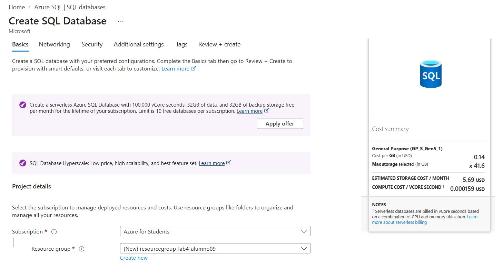
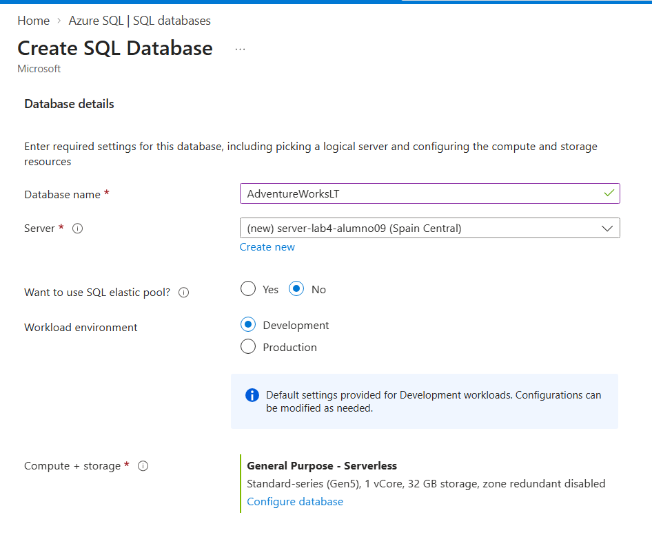
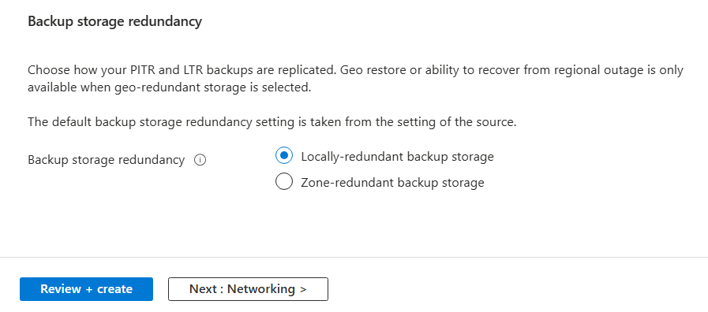
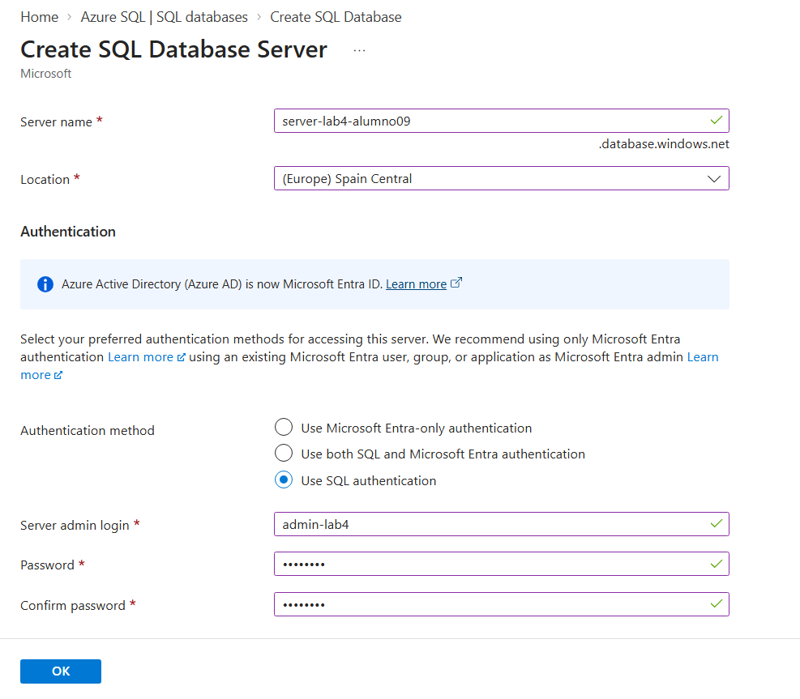
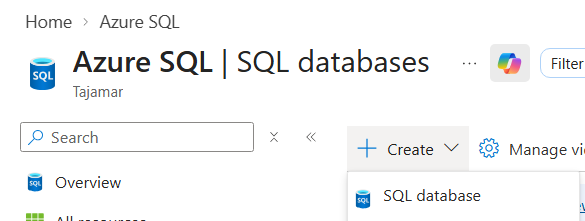
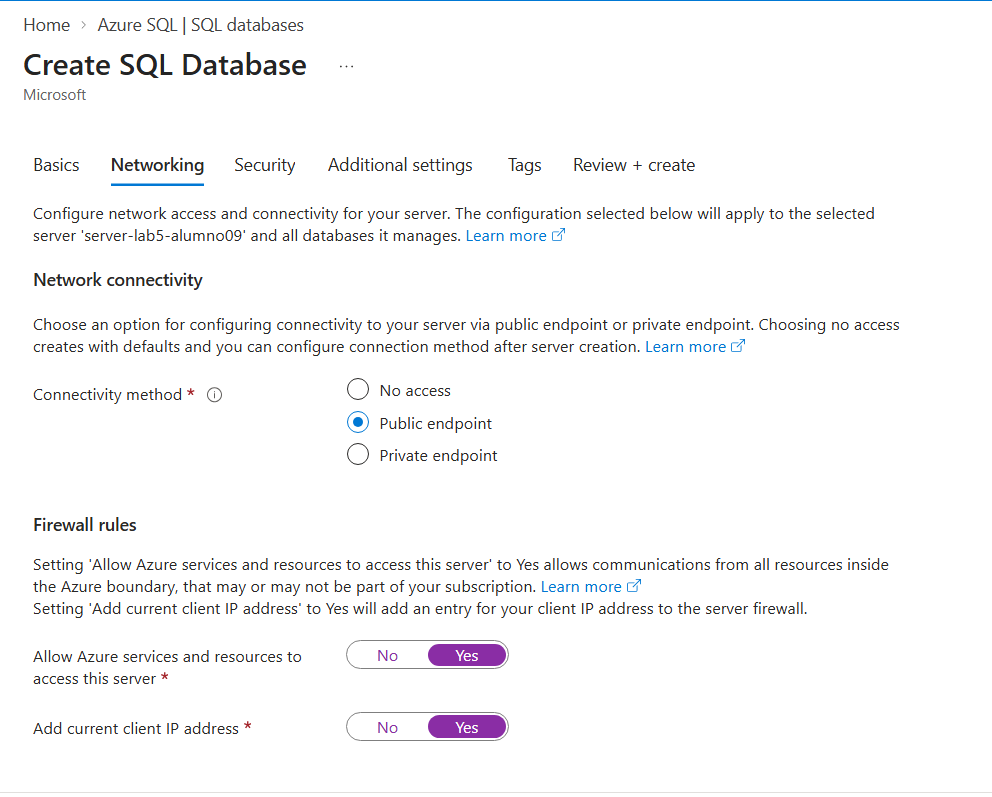
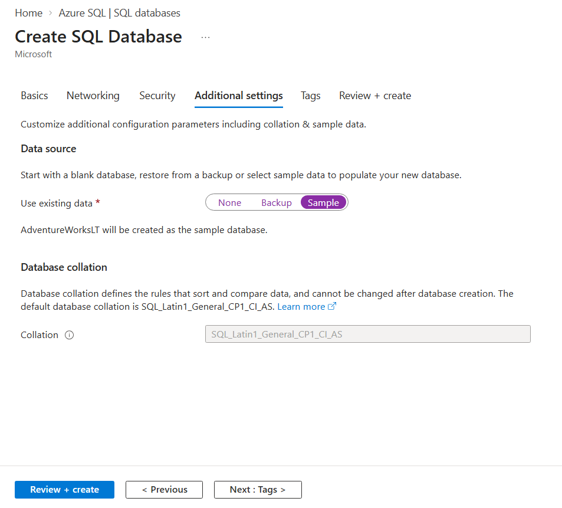

---

## Set up Visual Studio Code with GitHub Copilot

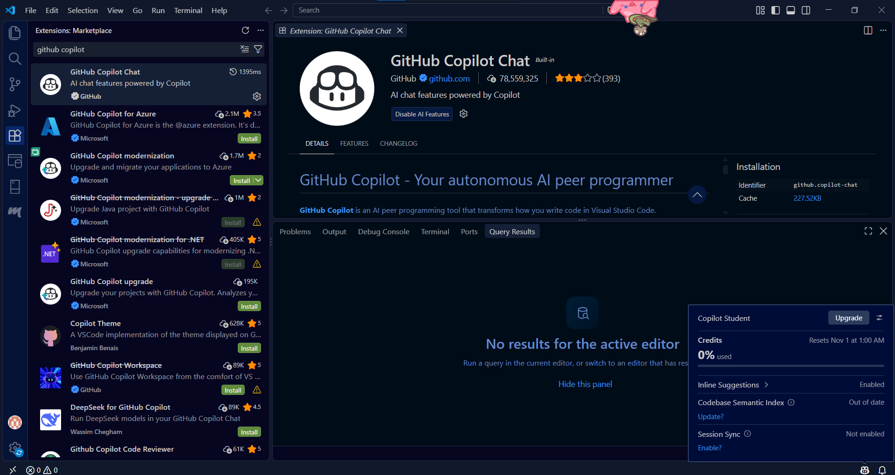

---

## Connect to the Azure SQL Database

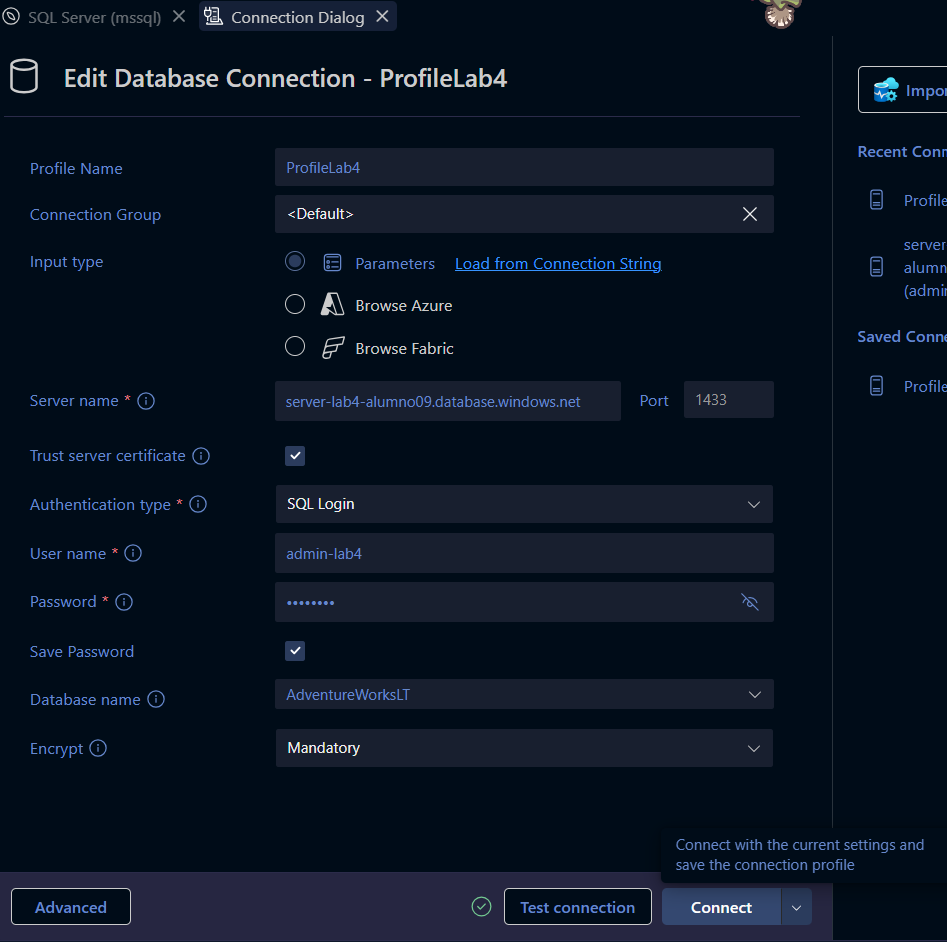
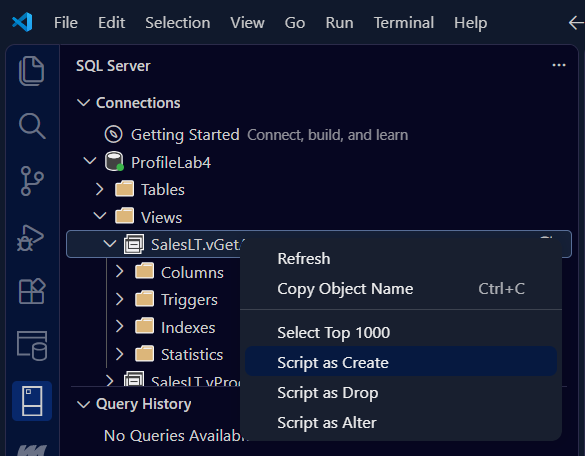

---

## Create a custom instruction file for Copilot

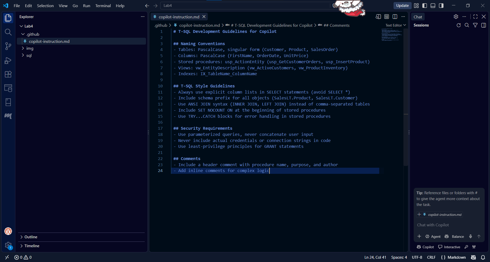

---

## Use Copilot to generate a stored procedure

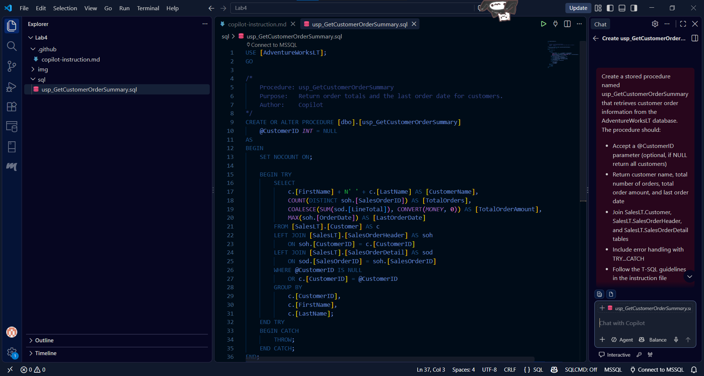

---

## Use Copilot to generate a view

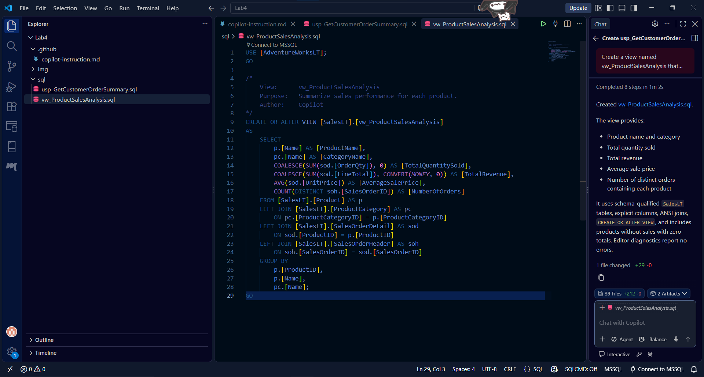

---

## Use Copilot to explain existing code

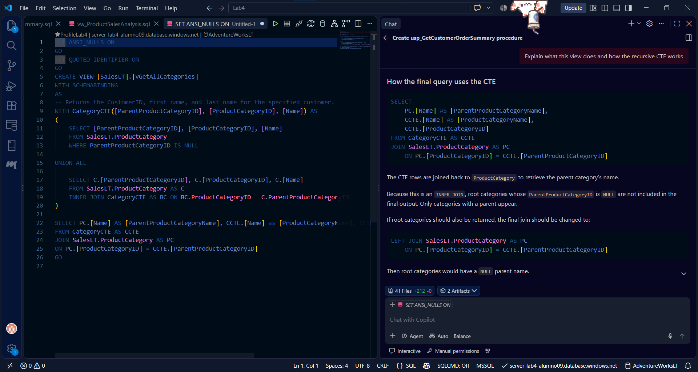

---

## Use Copilot for query optimization suggestions

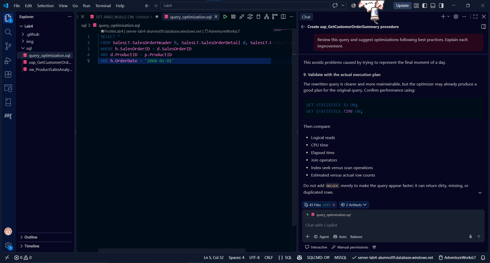

---

## Cleanup

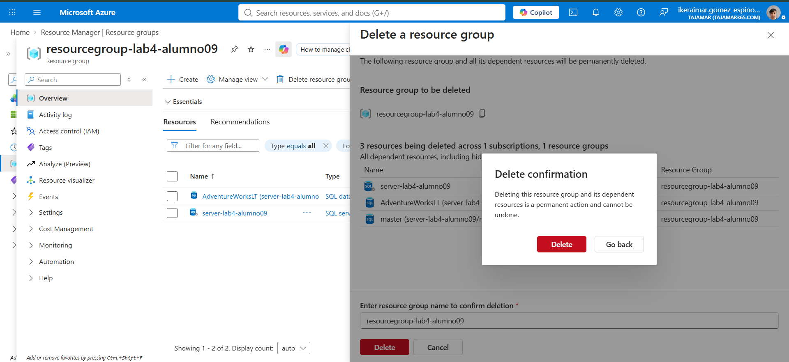
