# Práctica 07 - Caso SonoraDB

## Comprobar la versión del motor
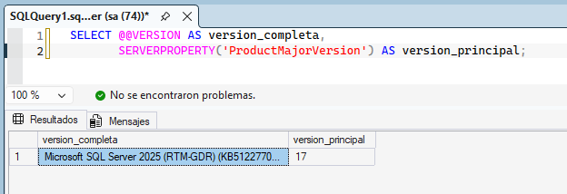

## Crear BD con nivel de compatibilidad 170
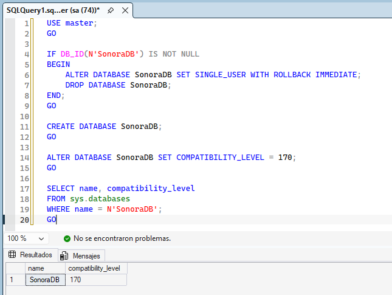

## Crear Tablas
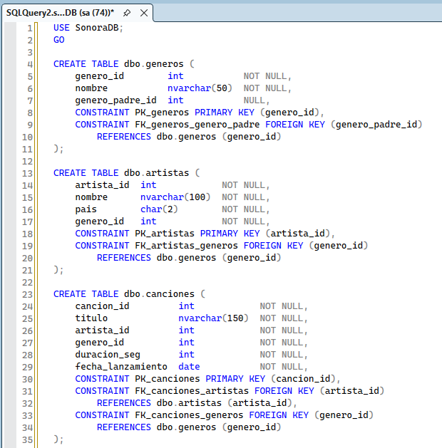
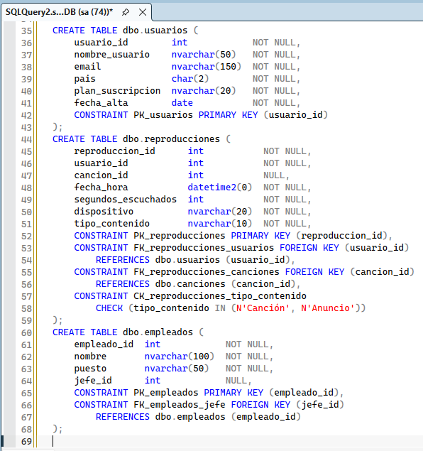
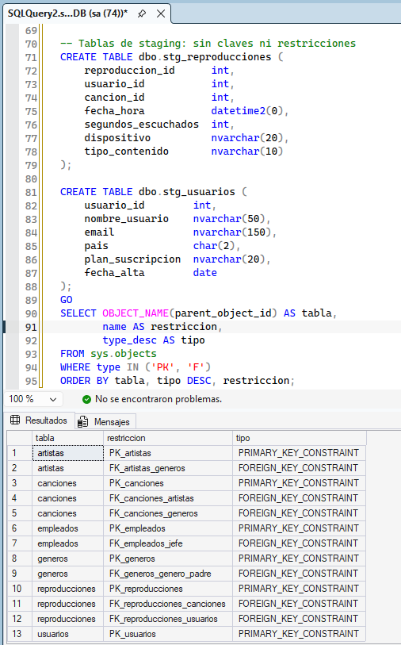

## Cargar Datos
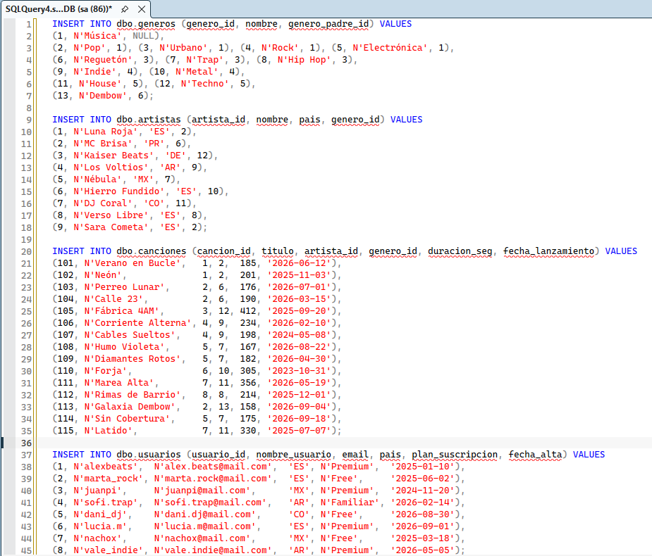
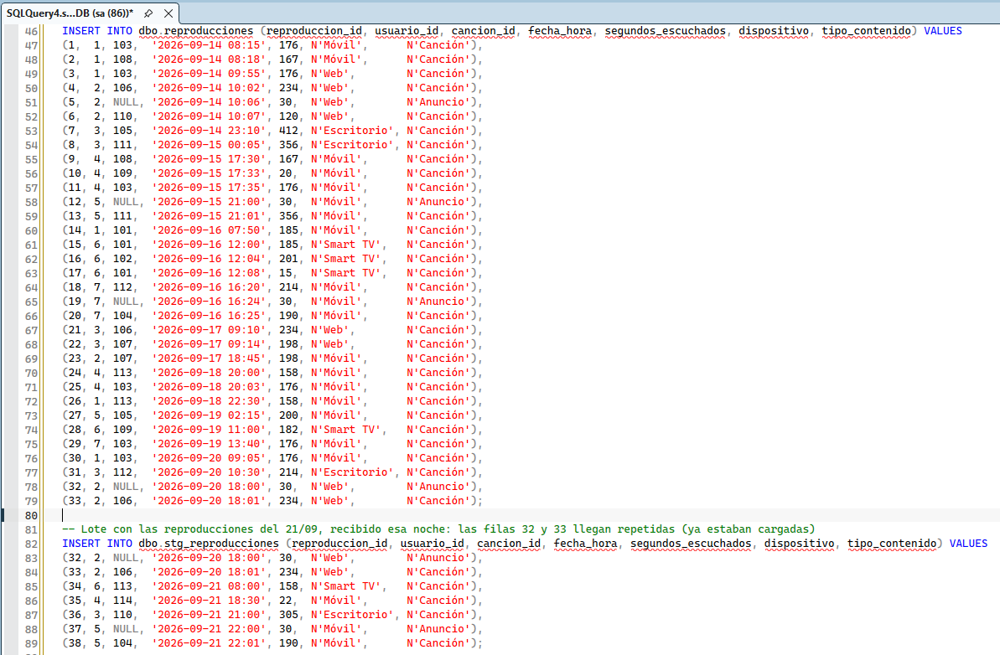
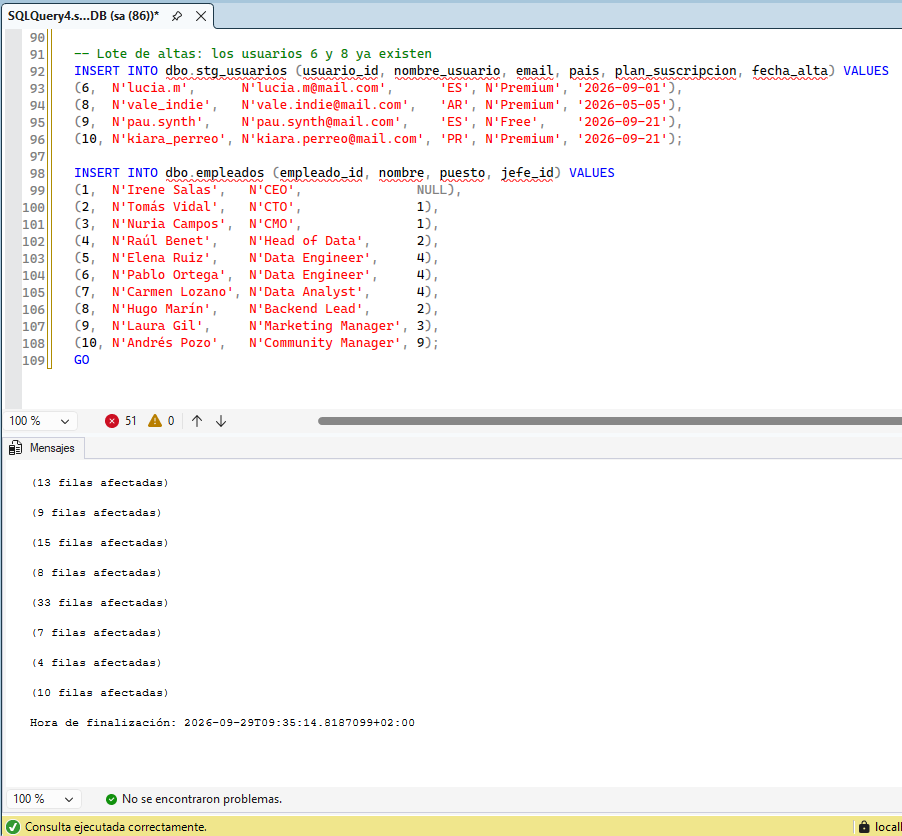

## Verificar la carga
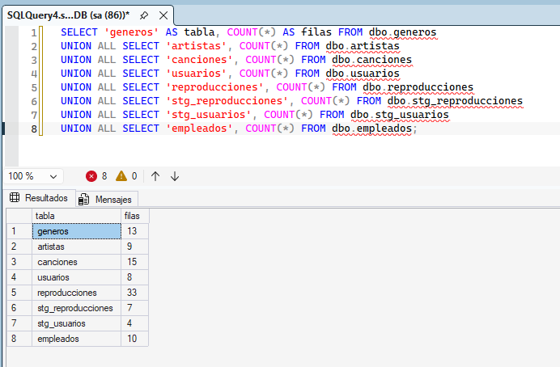

---

## Ejercicio 1
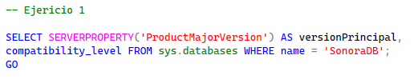

## Ejercicio 2
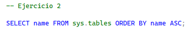

## Ejercicio 3
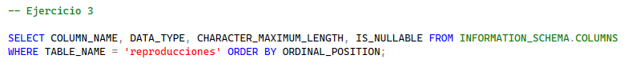

## Ejercicio 4
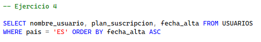

## Ejercicio 5
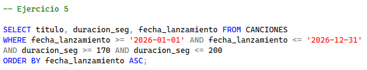

## Ejercicio 6
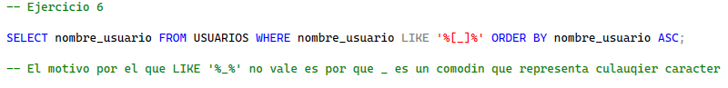

## Ejercicio 7
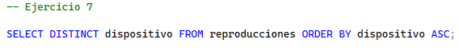

## Ejercicio 8
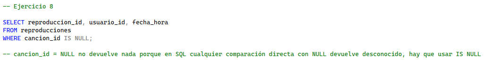

## Ejercicio 9
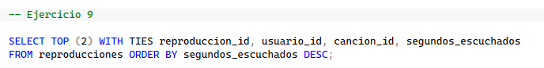

## Ejercicio 10
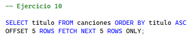

## Ejercicio 11
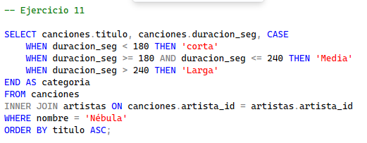

## Ejercicio 12
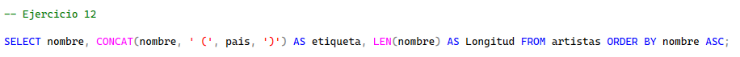

## Ejercicio 13
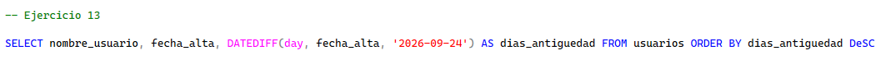

## Ejercicio 14
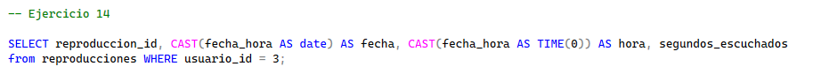

## Ejercicio 15
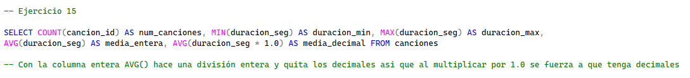

## Ejercicio 16
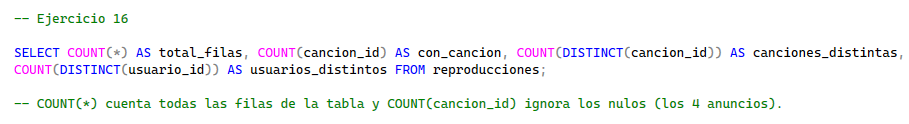

## Ejercicio 17
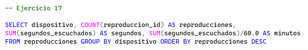

## Ejercicio 18
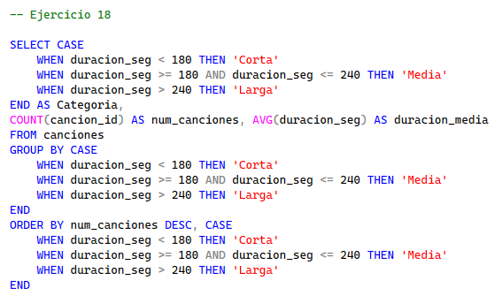

## Ejercicio 19
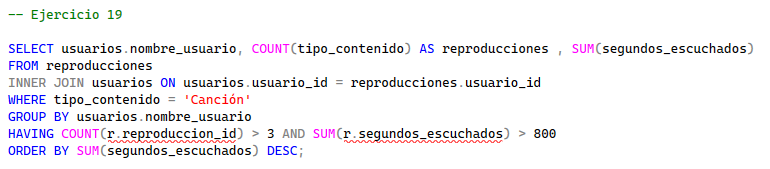

## Ejercicio 20
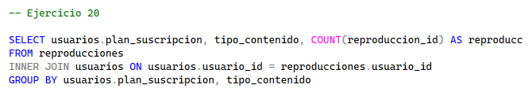

## Ejercicio 21
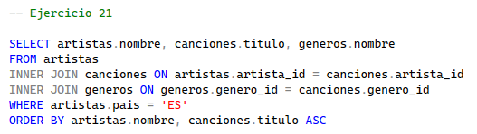

## Ejercicio 22
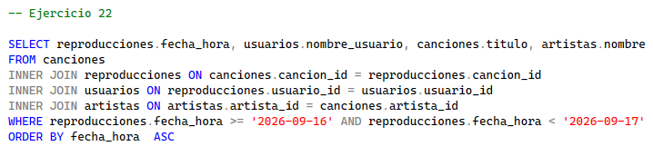

## Ejercicio 23
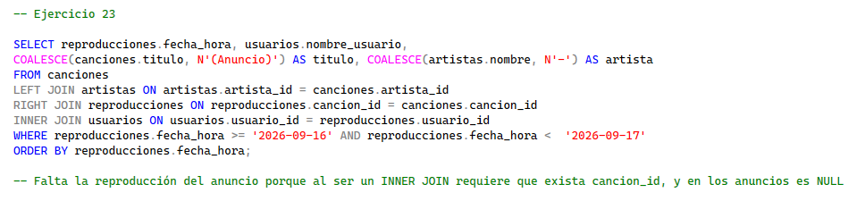

## Ejercicio 24
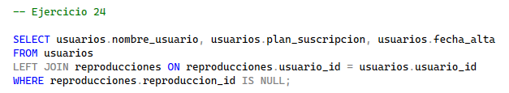

## Ejercicio 25
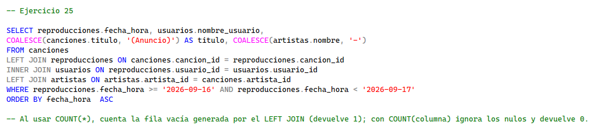

## Ejercicio 26
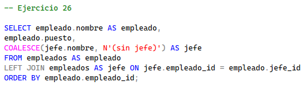

## Ejercicio 27
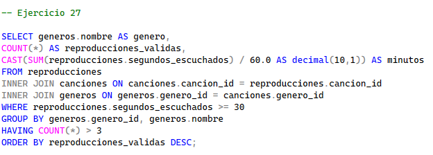

## Ejercicio 28
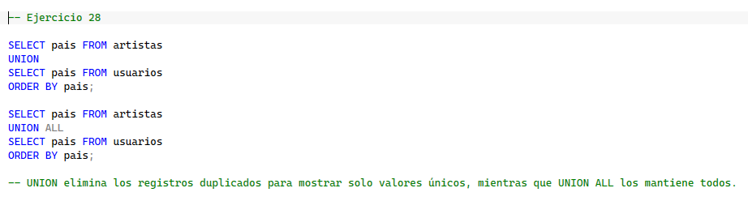

## Ejercicio 29
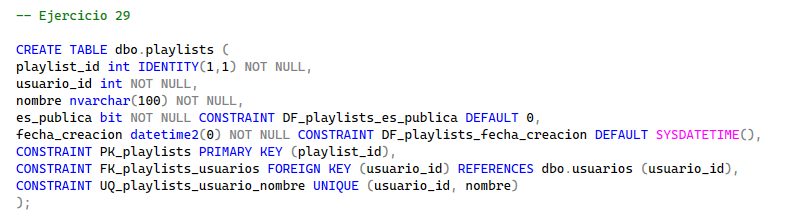

## Ejercicio 30
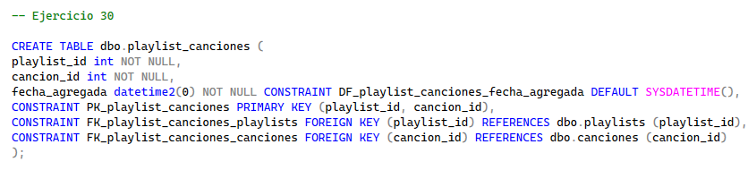

## Ejercicio 31
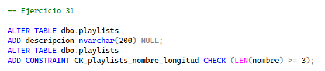

## Ejercicio 32
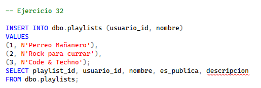

## Ejercicio 33
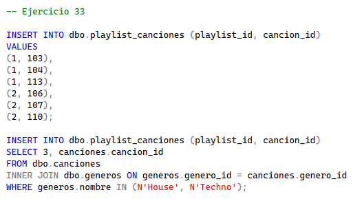

## Ejercicio 34
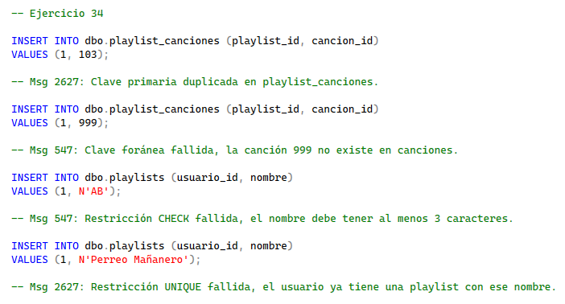

## Ejercicio 35
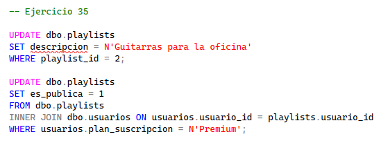

## Ejercicio 36
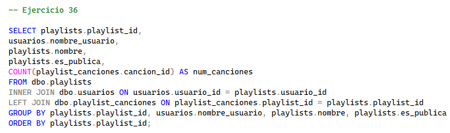

## Ejercicio 37
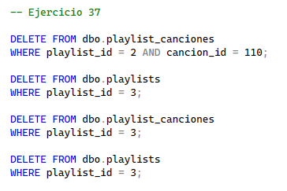

## Ejercicio 38
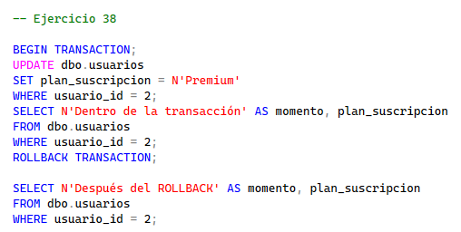

## Ejercicio 39
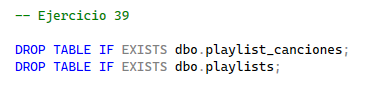
