# Clase 11 (Subconsultas)

## Ejemplos

### Ejemplo 1
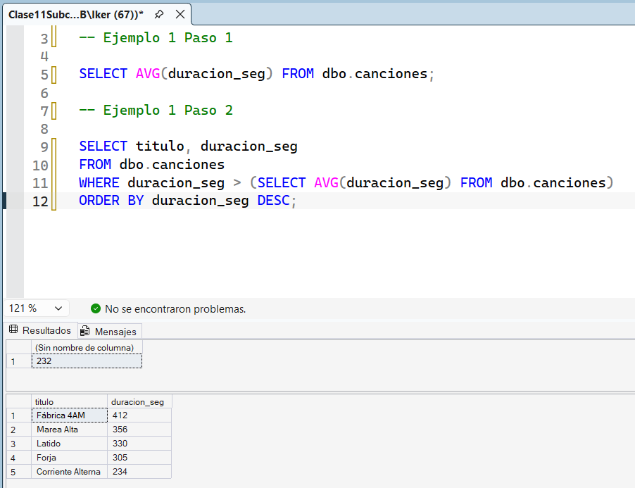

Se calcula primero la media de duración del catálogo (232 s) y después se usa como filtro en un `WHERE`. Devuelve las 5 canciones más largas que la media, de Fábrica 4AM (412 s) a Corriente Alterna (234 s).

### Ejemplo 2
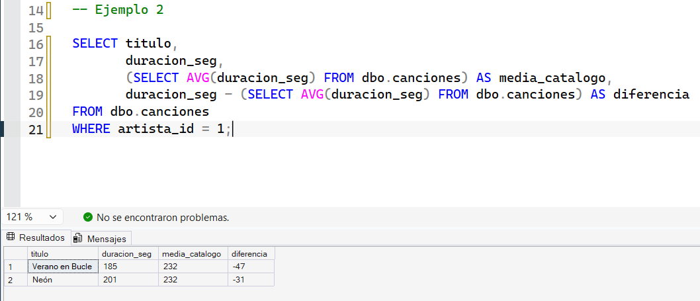

Dos subconsultas escalares en el `SELECT` muestran la media del catálogo (232) y la diferencia con la duración de cada canción de Luna Roja: Verano en Bucle −47 y Neón −31.

### Ejemplo 3
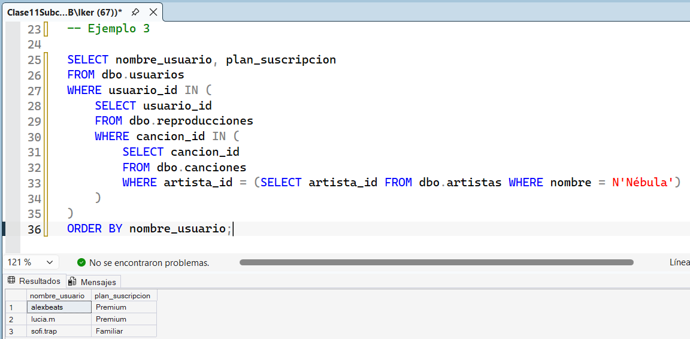

Tres subconsultas anidadas (artista, canciones y reproducciones) para obtener los usuarios que han escuchado a Nébula: alexbeats, lucia.m y sofi.trap.

### Ejemplo 4
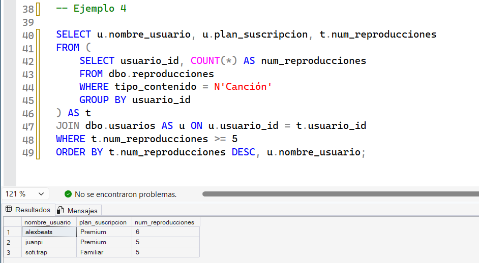

Una tabla derivada `t` cuenta las canciones reproducidas por usuario y se une con `usuarios`. Solo cumplen las 5 o más reproducciones alexbeats (6), juanpi (5) y sofi.trap (5).

### Ejemplo 5
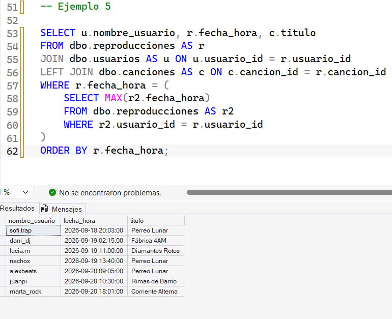

Subconsulta correlacionada con `MAX(fecha_hora)` por usuario. Muestra la última reproducción de 7 usuarios; vale_indie no aparece porque no tiene reproducciones.

### Ejemplo 6
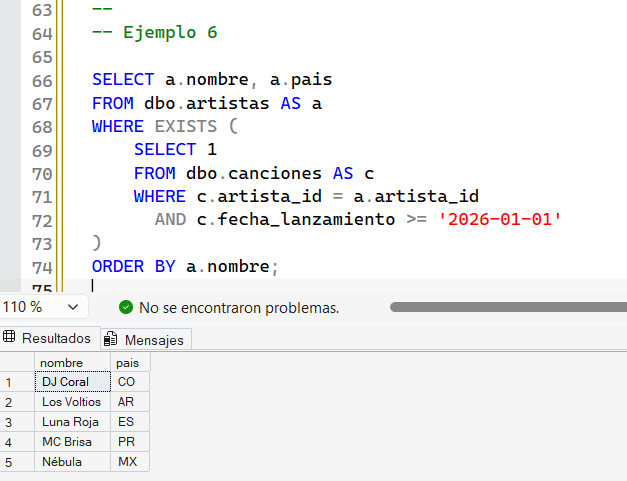

`EXISTS` para listar los artistas con alguna canción lanzada desde 2026: DJ Coral, Los Voltios, Luna Roja, MC Brisa y Nébula.

### Ejemplo 7
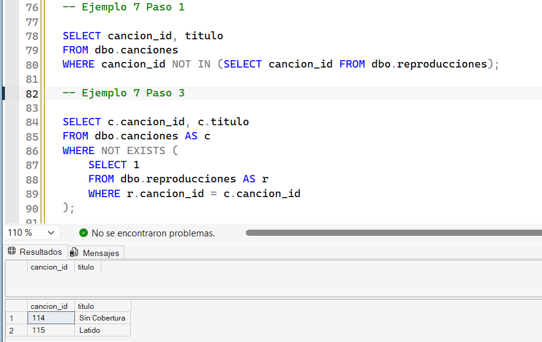

El `NOT IN` del paso 1 devuelve 0 filas por los `NULL` de los anuncios, y el `NOT EXISTS` del paso 3 devuelve las dos canciones nunca reproducidas: Sin Cobertura (114) y Latido (115).

### Ejemplo 8
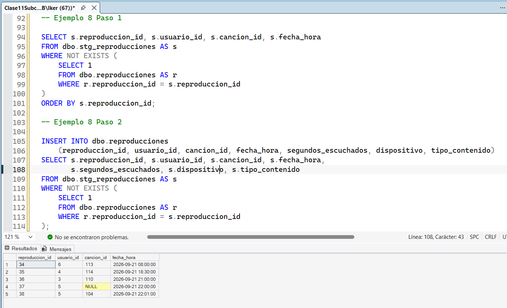

Anti-join con `NOT EXISTS` sobre `stg_reproducciones` y, debajo, el `INSERT ... SELECT` que carga solo las filas nuevas. El resultado del paso 1 muestra las 5 reproducciones por cargar (34 a 38), una con `cancion_id` a `NULL`.

---

# Clase 12 (CTE)

## Ejemplos

En cada ejemplo se muestra el equivalente con subconsultas del ejemplo de CTE.

### Ejemplo 9
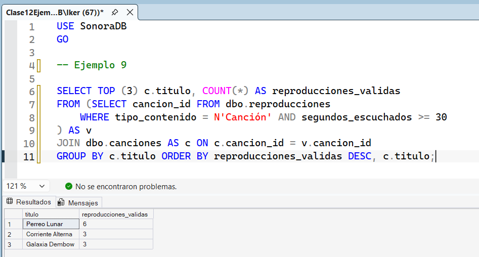

La CTE `validas` se sustituye por una tabla derivada `v` en el `FROM`. El top 3 de canciones con más reproducciones válidas es Perreo Lunar (6), Corriente Alterna (3) y Galaxia Dembow (3).

### Ejemplo 10
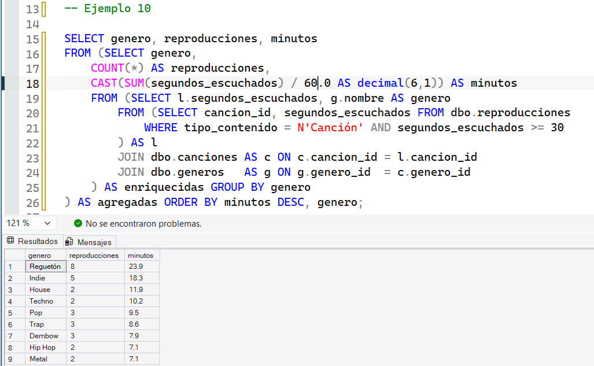

Las tres CTE del pipeline (limpiar, enriquecer, agregar) se convierten en tres subconsultas anidadas. Muestra reproducciones y minutos por género, con Reguetón primero (8 reproducciones, 23.9 min).

### Ejemplo 11
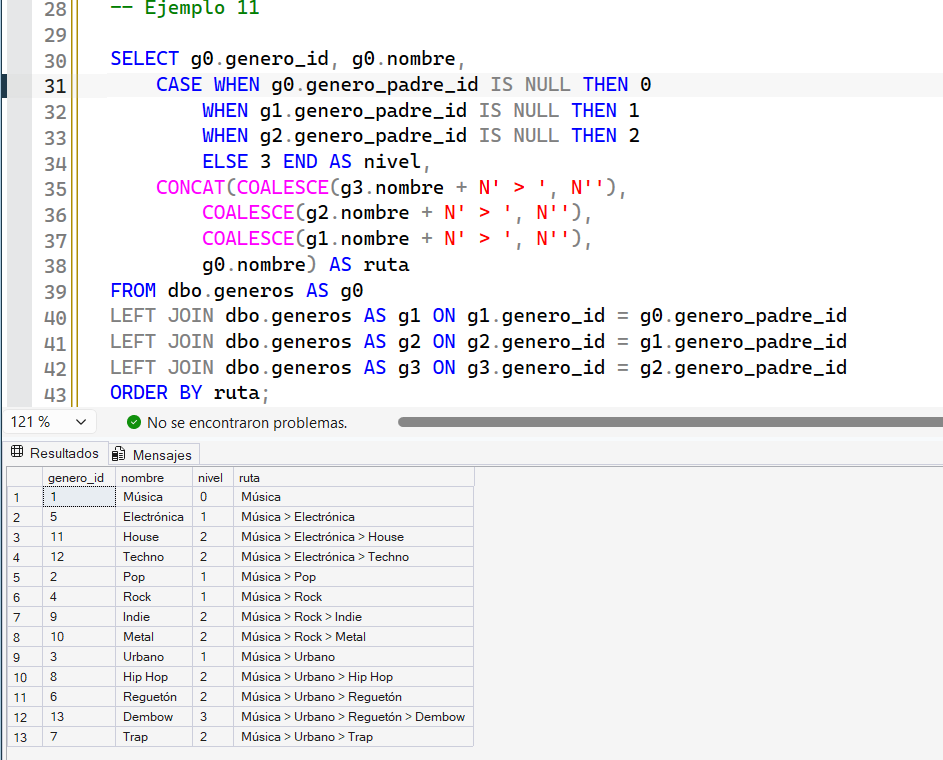

El árbol de géneros sin recursión: la tabla `generos` se une consigo misma tres veces con `LEFT JOIN`, y un `CASE` calcula el nivel. Salen los 13 géneros con su nivel y su ruta, hasta Música > Urbano > Reguetón > Dembow (nivel 3).

### Ejemplo 12
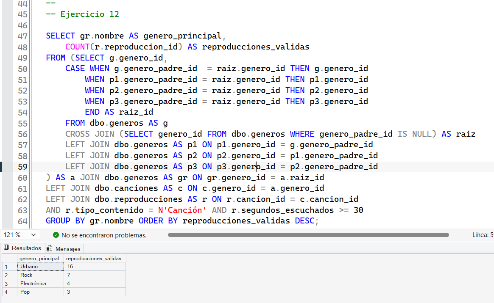

El género principal de cada subgénero se resuelve con un `CROSS JOIN` a la raíz y tres `LEFT JOIN` a los padres. Resultado: Urbano 16, Rock 7, Electrónica 4 y Pop 3 reproducciones válidas.

### Ejemplo 13
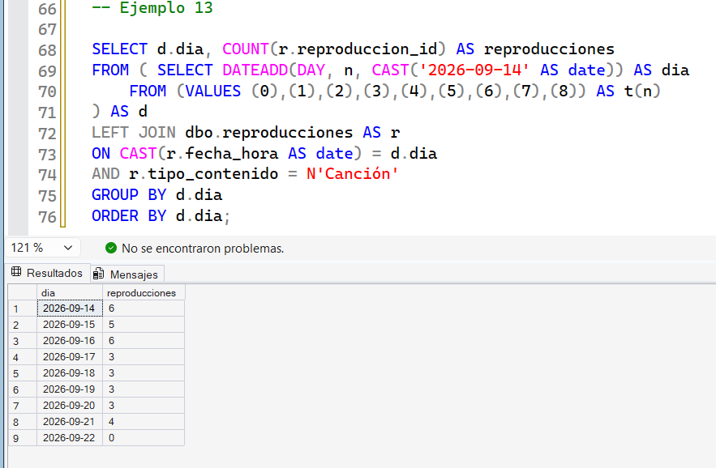

Los días se generan con `VALUES (0..8)` y `DATEADD` en lugar de recursión, y se unen con `LEFT JOIN` a las reproducciones. Salen los 9 días del 14 al 22/09, y el 22 tiene 0 reproducciones.

## Ejercicios

### Ejercicio 1
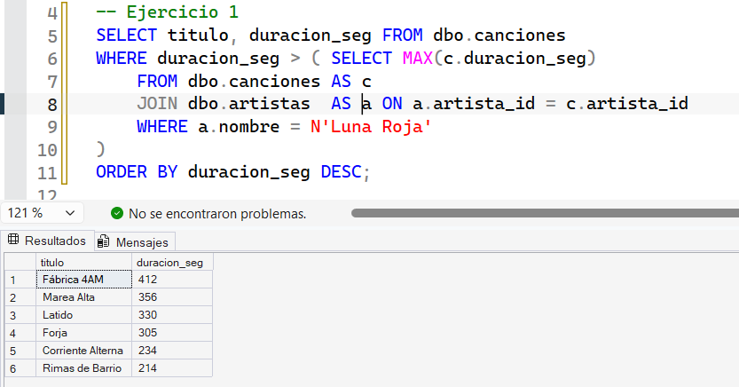

Subconsulta escalar que obtiene la duración máxima de Luna Roja a partir de su nombre. Devuelve las 6 canciones más largas que esa duración, de Fábrica 4AM (412 s) a Rimas de Barrio (214 s).

### Ejercicio 2
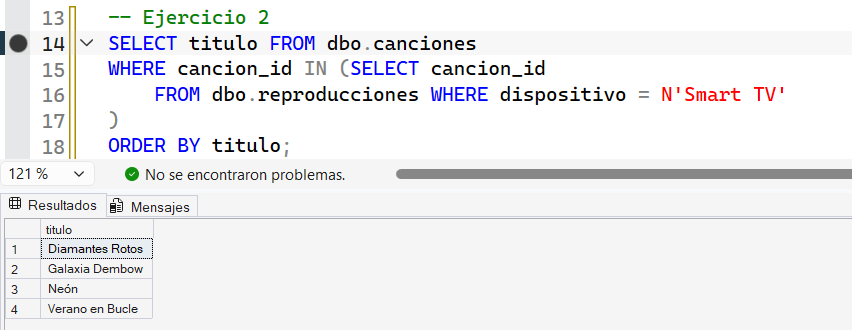

Subconsulta con `IN` sobre las reproducciones desde `Smart TV`. Títulos: Diamantes Rotos, Galaxia Dembow, Neón y Verano en Bucle.

### Ejercicio 3
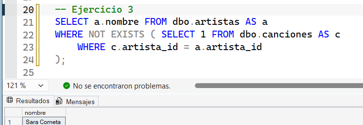

`NOT EXISTS` para detectar artistas sin canciones. Solo aparece Sara Cometa.

### Ejercicio 4
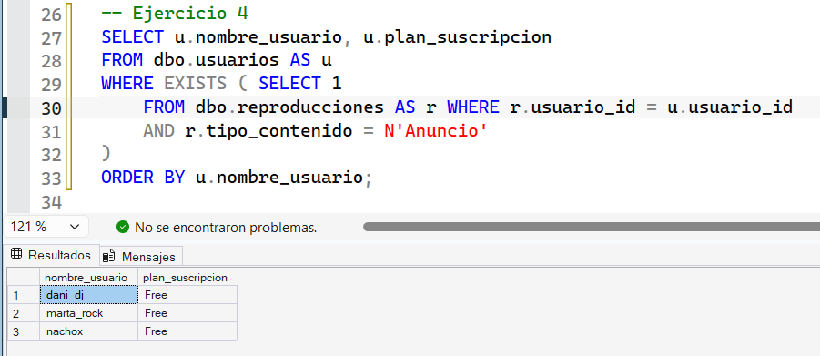

`EXISTS` sobre las reproducciones de tipo `Anuncio`. Los usuarios que han escuchado algún anuncio son dani_dj, marta_rock y nachox, los tres con plan Free.

### Ejercicio 5
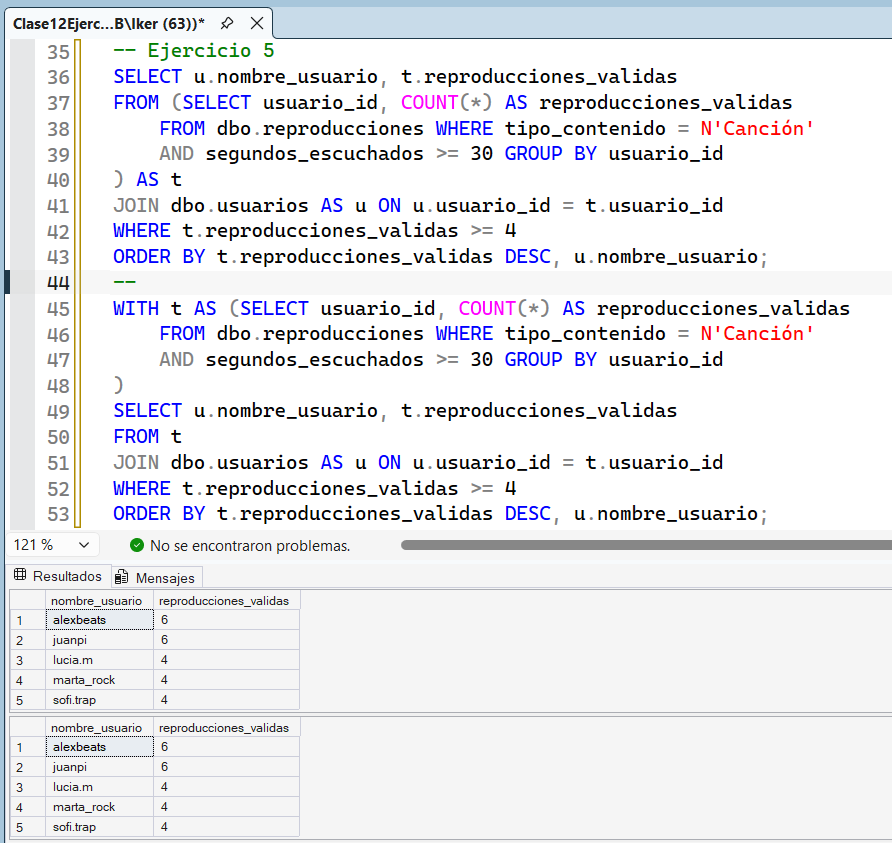

La misma consulta resuelta con una tabla derivada y con una CTE, con idéntico resultado: alexbeats y juanpi (6 reproducciones válidas), y lucia.m, marta_rock y sofi.trap (4).

### Ejercicio 6
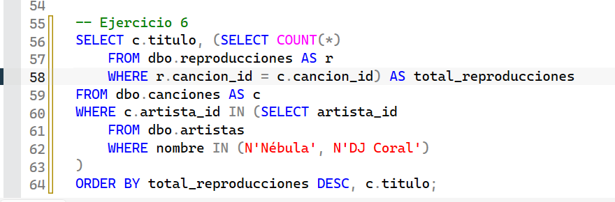

Subconsulta correlacionada en el `SELECT` para contar las reproducciones de cada canción, y subconsulta con `IN` para filtrar los artistas Nébula y DJ Coral por nombre, ordenando por reproducciones y título.

### Ejercicio 7

**Explicación:** la consulta del compañero devuelve 0 filas porque la subconsulta también devuelve `NULL`. Los anuncios de los usuarios Free (marta_rock, dani_dj y nachox) tienen `cancion_id` a `NULL`. `cancion_id NOT IN (..., NULL)` se expande a `cancion_id <> NULL`, que da `UNKNOWN`, así que la condición nunca es `TRUE` y no se devuelve ninguna fila.

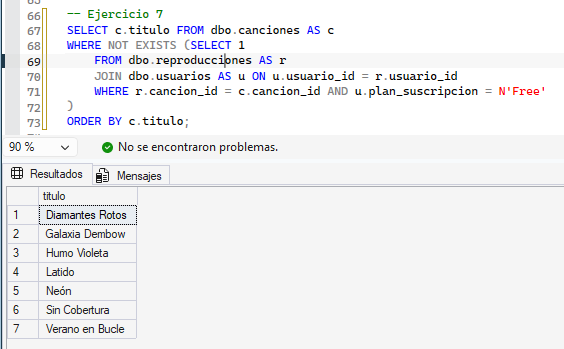

La versión con `NOT EXISTS` no se ve afectada por los `NULL`. Devuelve las 7 canciones que ningún usuario Free ha escuchado, de Diamantes Rotos a Verano en Bucle.

### Ejercicio 8
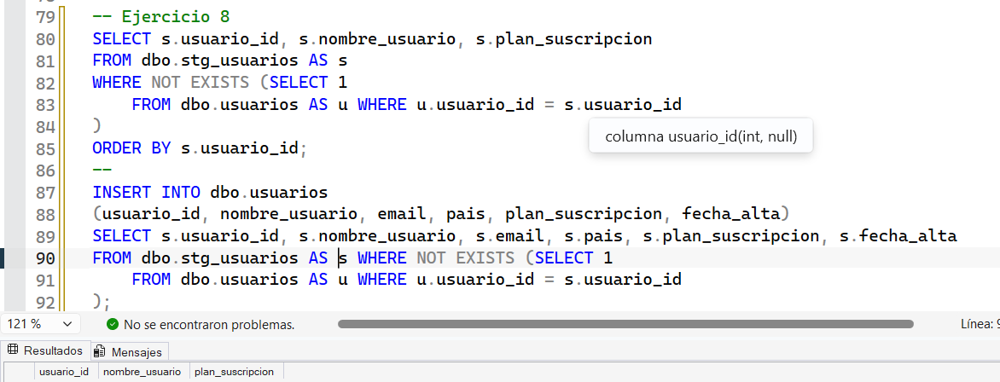

Consulta con `NOT EXISTS` que identifica los usuarios de `stg_usuarios` aún no cargados, seguida del `INSERT ... SELECT` idempotente. La consulta no devuelve filas, porque todos los usuarios del staging ya existen en `usuarios`.

### Ejercicio 9
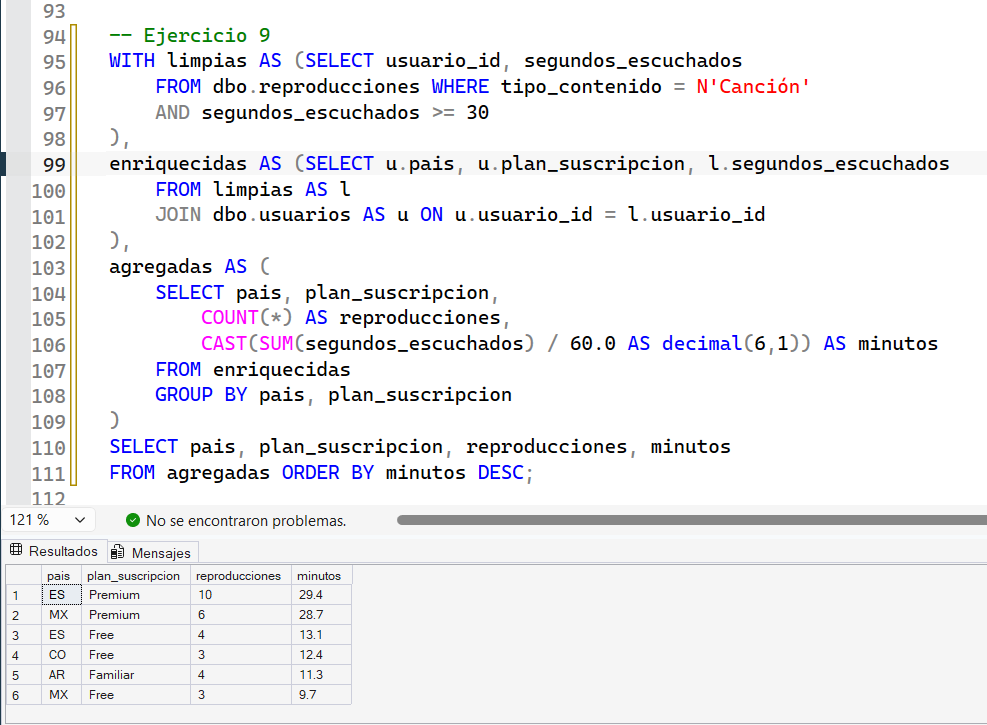

Pipeline de tres CTE encadenadas (`limpias`, `enriquecidas`, `agregadas`) que devuelve reproducciones y minutos por país y plan. Primera fila: ES Premium, 10 reproducciones y 29.4 min; última: MX Free, 3 y 9.7.

### Ejercicio 10
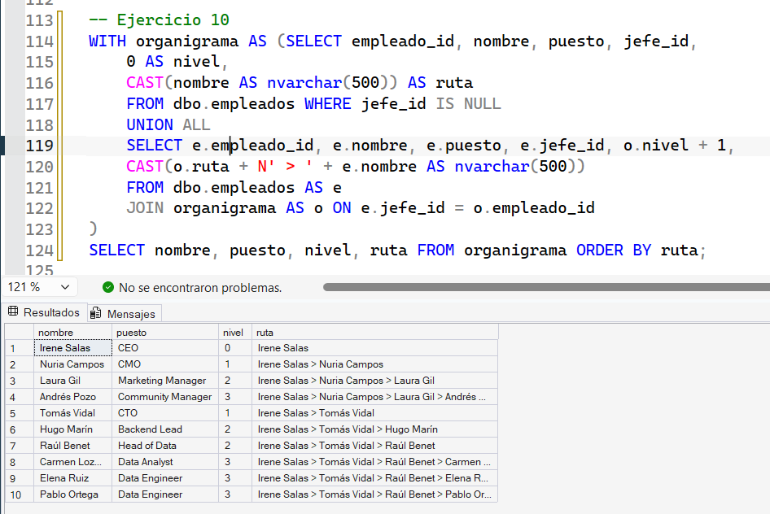

CTE recursiva del organigrama con nivel y ruta desde la CEO. Salen los 10 empleados, de Irene Salas (nivel 0) a los tres analistas e ingenieros de datos (nivel 3).

### Ejercicio 11
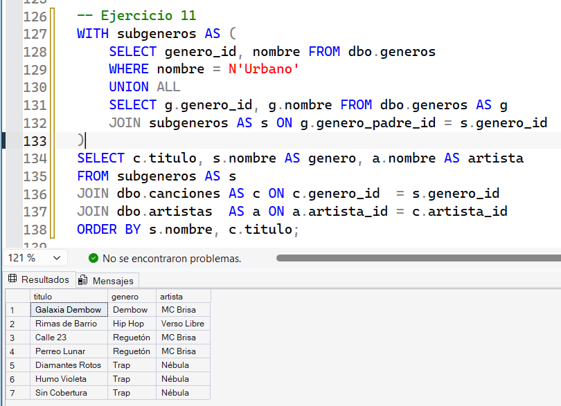

CTE recursiva que parte del género `Urbano` por nombre y recorre todos sus subgéneros. Devuelve 7 canciones: Dembow, Hip Hop, Reguetón y Trap, con su artista.

### Ejercicio 12
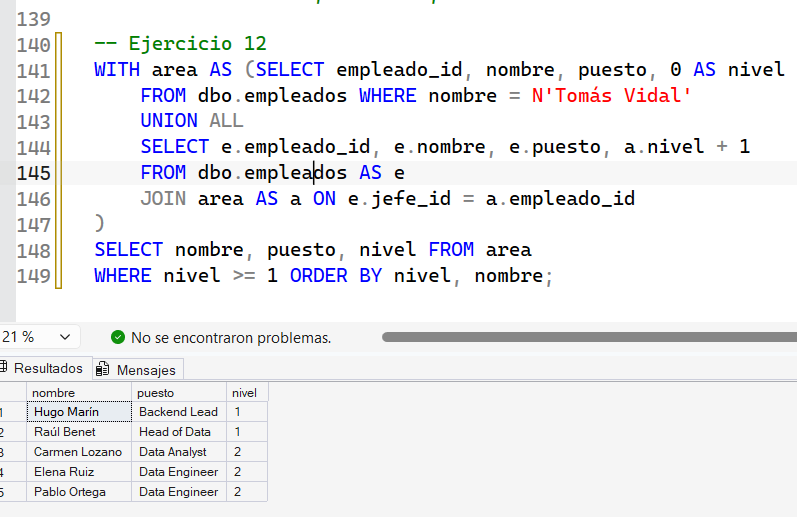

CTE recursiva que parte de Tomás Vidal y filtra `nivel >= 1` para excluirle. Salen 5 personas: Hugo Marín y Raúl Benet (nivel 1), y Carmen Lozano, Elena Ruiz y Pablo Ortega (nivel 2).

---

# Clase 13 (Vistas)

## Ejercicios

### Ejercicio 1
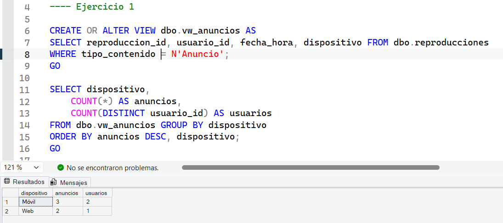

Se crea la vista `vw_anuncios` y se consulta agrupando por dispositivo. Muestra Móvil con 3 anuncios y 2 usuarios, y Web con 2 anuncios y 1 usuario.

### Ejercicio 2
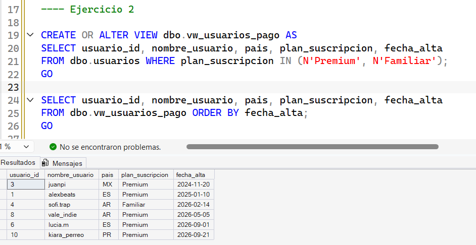

Se crea `vw_usuarios_pago` con los planes Premium y Familiar y sin la columna `email`. Salen 6 usuarios ordenados por fecha de alta, de juanpi (2024-11-20) a kiara_perreo (2026-09-21).

### Ejercicio 3
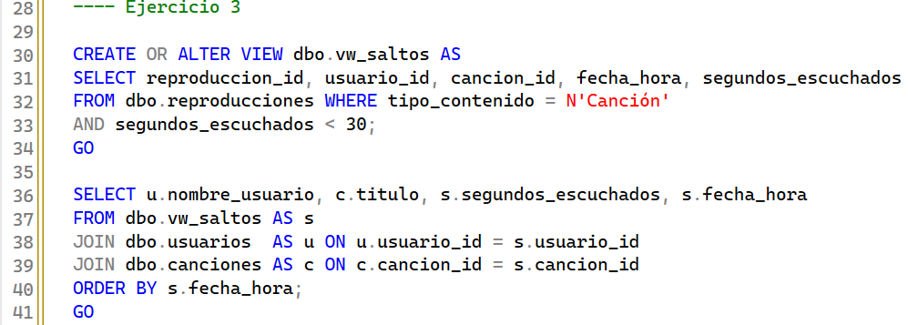

Se crea `vw_saltos` con las canciones de menos de 30 segundos y se une con `usuarios` y `canciones`. La consulta muestra nombre de usuario, título, segundos escuchados y fecha y hora, ordenados por fecha.

### Ejercicio 4

**Explicación:** Sara Cometa no aparece porque `vw_catalogo_detalle` une `canciones` con `artistas` y `generos` mediante `JOIN` internos. Sara Cometa no tiene ninguna canción, así que no hay fila de `canciones` con la que unirla y queda fuera del resultado.

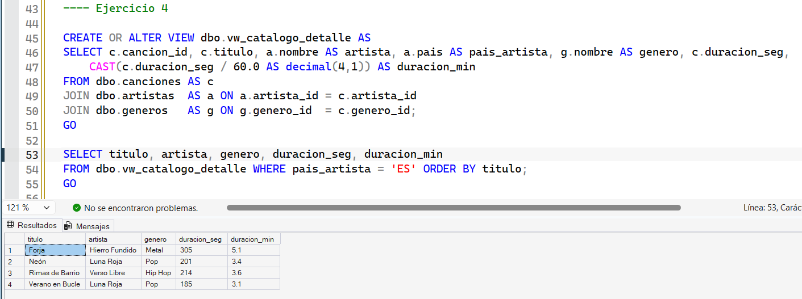

Se crea `vw_catalogo_detalle` con la duración en segundos y en minutos. La consulta de artistas españoles devuelve 4 canciones: Forja, Neón, Rimas de Barrio y Verano en Bucle.

### Ejercicio 5

**Explicación:** hay dos problemas. El primero es el `ORDER BY` dentro de la vista, que no está permitido (Msg 1033): el orden lo debe poner quien consulta la vista. El segundo es que `COUNT(*)` no tiene alias, y toda columna de una vista necesita nombre. Se corrige llamando `reproducciones` a la columna y ordenando en la consulta.

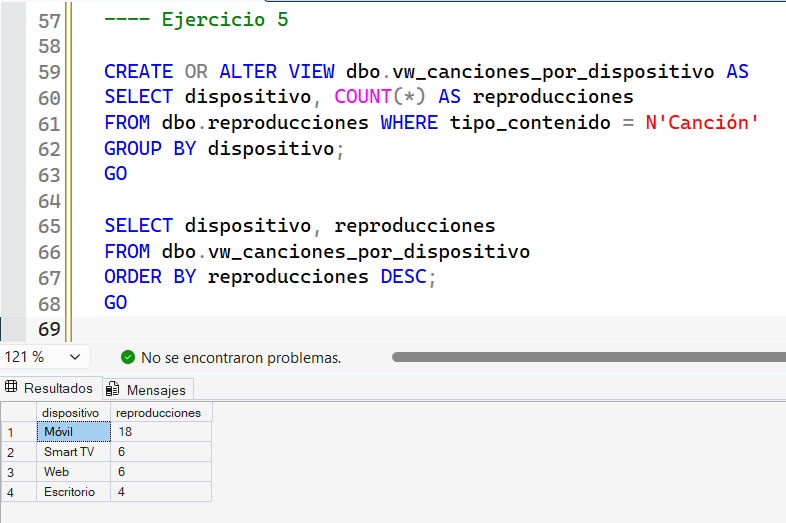

Se crea `vw_canciones_por_dispositivo` y se consulta ordenada de más a menos reproducciones: Móvil 18, Smart TV 6, Web 6 y Escritorio 4.

### Ejercicio 6
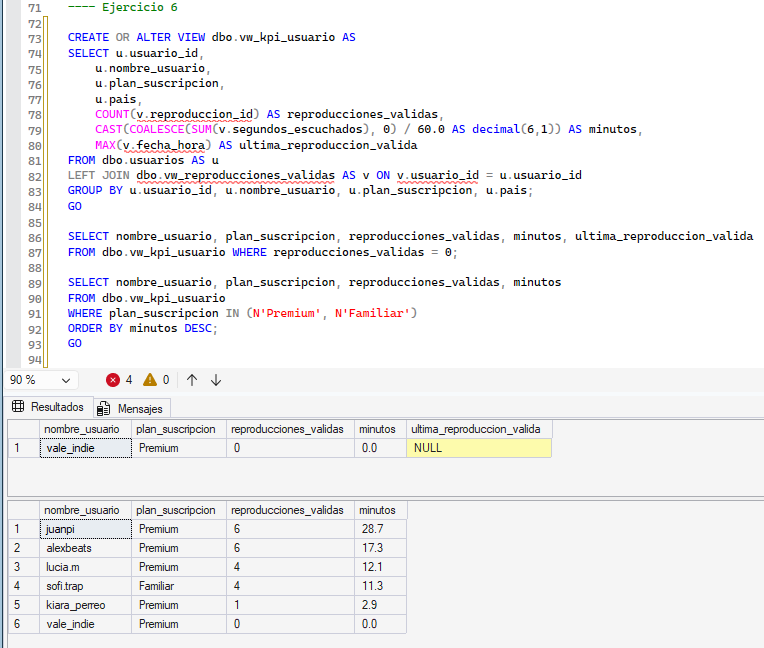

Se crea `vw_kpi_usuario` con un `LEFT JOIN` a `vw_reproducciones_validas`, de modo que aparecen también los usuarios sin actividad. La primera consulta devuelve vale_indie con 0 reproducciones, 0.0 minutos y última reproducción `NULL`. La segunda lista los 6 usuarios de pago por minutos, con juanpi primero (28.7).

### Ejercicio 7
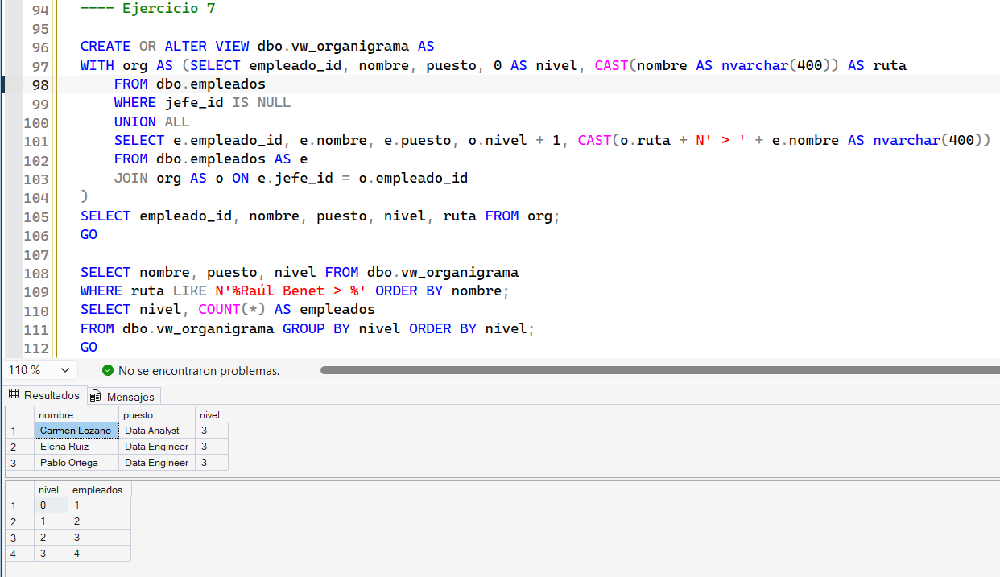

La CTE recursiva del organigrama se guarda en la vista `vw_organigrama`. La primera consulta devuelve las tres personas que dependen de Raúl Benet (Carmen Lozano, Elena Ruiz y Pablo Ortega), y la segunda el número de empleados por nivel (1, 2, 3 y 4).

### Ejercicio 8

**Predicción:**

| Sentencia | Resultado previsto | Motivo |
|---|---|---|
| a) | `(1 row affected)` | Humo Violeta es de 2026 y, tras el cambio, sigue cumpliendo el `WHERE` de la vista. |
| b) | `Msg 550` | La fecha 2025-12-15 sacaría la fila de la vista, y `WITH CHECK OPTION` lo impide. |
| c) | `(0 rows affected)` | Neón es de 2025: no pertenece a la vista, así que el `UPDATE` no ve esa fila. |
| d) | `Msg 550` | Insertar una canción de 2025 no cumple el `WHERE` de la vista. |
| e) | `(1 row affected)` | La fecha 2026-10-02 sí cumple el `WHERE`. |

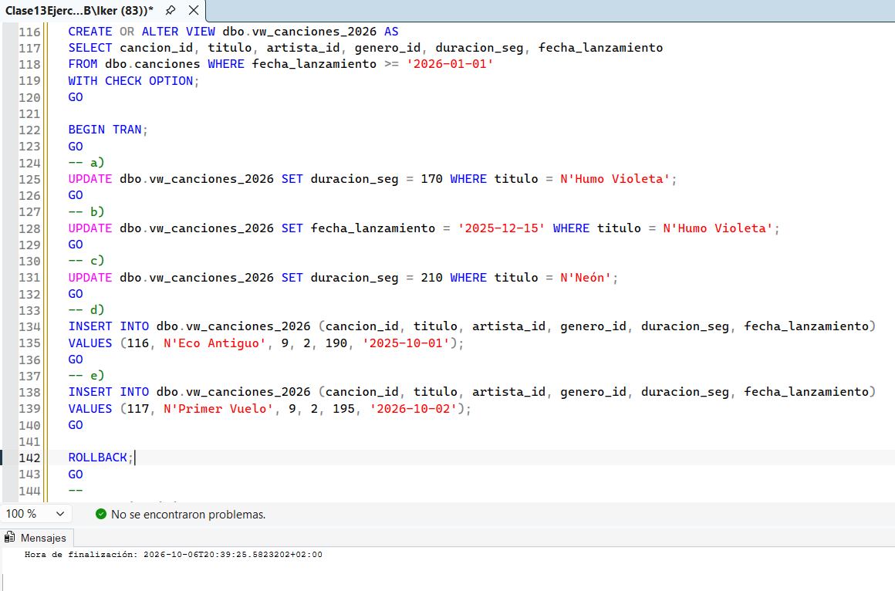

Se crea `vw_canciones_2026` con `WITH CHECK OPTION` y se ejecutan las cinco sentencias, una a una, dentro de `BEGIN TRAN` y con un `ROLLBACK` final para dejar los datos como estaban.

### Ejercicio 9

**Predicción:**

| Sentencia | Resultado previsto | Motivo |
|---|---|---|
| a) | `(1 row affected)` | `duracion_seg` pertenece solo a `canciones`: una única tabla base. |
| b) | `Msg 4405` | Se modifican a la vez `titulo` (`canciones`) y `artista` (`artistas`): varias tablas base. |
| c) | `Msg 4406` | `duracion_min` es una expresión calculada, no una columna real. |
| d) | `(1 row affected)` | `artista` pertenece solo a `artistas`: una única tabla base. |

**Explicación:** el artista de Verano en Bucle cambia también porque la columna `artista` de la vista es `artistas.nombre`. El `UPDATE` se traduce en un cambio sobre la única fila de Luna Roja (`artista_id` 1), que comparten sus dos canciones. Filtrar por `titulo` selecciona la fila de la vista, pero no limita el cambio a esa canción, ya que se modifica el dato del lado "uno" de la relación.

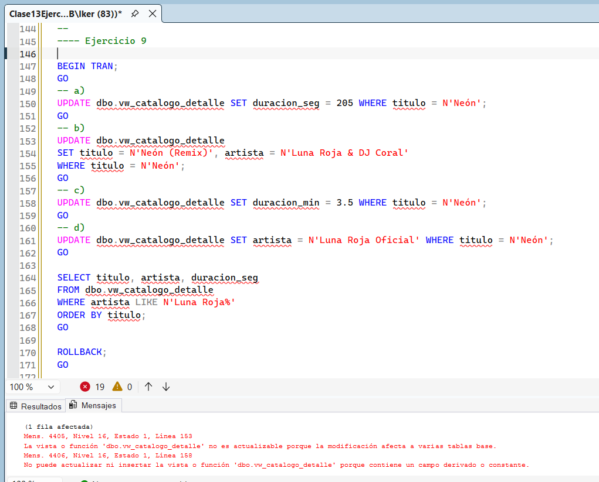

Las cuatro sentencias se ejecutan dentro de una transacción. La pestaña Mensajes muestra `(1 fila afectada)` para el apartado a), el error 4405 para el b) y el error 4406 para el c).

### Ejercicio 10

**a) Explicación:** la vista del compañero tiene tres problemas. `SELECT *` no se admite en una vista con `SCHEMABINDING` (Msg 1054). `artistas` está sin esquema, y hacen falta nombres de dos partes: `dbo.artistas` (Msg 4512). Además, `*` repetiría columnas con el mismo nombre (`nombre` y `genero_id` están en ambas tablas), y una vista exige nombres de columna únicos. Se corrige listando las columnas y usando alias.

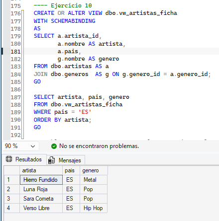

Se crea `vw_artistas_ficha` con `SCHEMABINDING`, columnas explícitas y alias. La consulta de artistas españoles devuelve Hierro Fundido (Metal), Luna Roja (Pop), Sara Cometa (Pop) y Verso Libre (Hip Hop).

**b) Explicación:** ampliar `nombre` falla con el Msg 5074 y el Msg 4922 porque la vista `vw_artistas_ficha` está enlazada al esquema y usa esa columna. Mientras una vista con `SCHEMABINDING` dependa de una columna, SQL Server no permite alterarla. Se genera un Msg 5074 por cada vista enlazada que use la columna, y la tabla queda sin cambios.

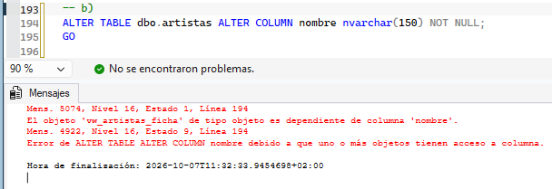

El `ALTER TABLE` sobre `artistas.nombre` devuelve el Msg 5074 ("el objeto `vw_artistas_ficha` es dependiente de la columna `nombre`") y el Msg 4922.

**c) Explicación:** solo impiden el cambio las vistas con `SCHEMABINDING`, en este caso `vw_artistas_ficha`. Las demás vistas que dependen de `artistas` no están enlazadas al esquema, así que SQL Server no las protege: el `ALTER` se permitiría y bastaría ejecutar `sp_refreshview` sobre ellas para actualizar sus metadatos.

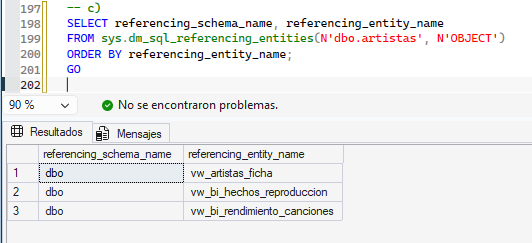

`sys.dm_sql_referencing_entities` sobre `dbo.artistas` lista tres vistas dependientes: `vw_artistas_ficha`, `vw_bi_hechos_reproduccion` y `vw_bi_rendimiento_canciones`.

### Ejercicio 11

**a) Explicación:** el intento original falla al crear el índice (Msg 10125) porque una vista indexada no admite `AVG` (tampoco `MIN`, `MAX`, `DISTINCT` ni `TOP`) y, al llevar `GROUP BY`, debe incluir `COUNT_BIG(*)`. La solución es guardar `COUNT_BIG(*)` y `SUM(segundos_escuchados)`, y calcular la media al consultar como `segundos / reproducciones_validas`.

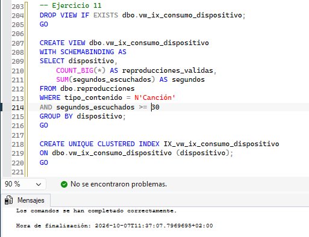

Se elimina y se crea `vw_ix_consumo_dispositivo` con `SCHEMABINDING`, `COUNT_BIG(*)` y `SUM`, y se crea sobre ella el índice clustered único. Mensajes indica que los comandos se completaron correctamente.

**b)**

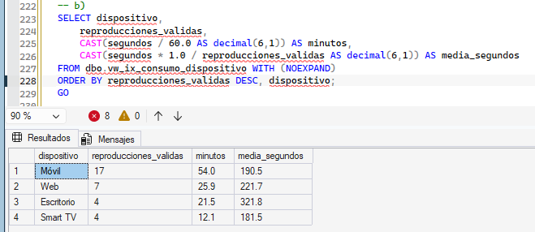

Consulta con `NOEXPAND` que calcula minutos y media de segundos con un decimal: Móvil 17 reproducciones (54.0 min, media 190.5), Web 7 (25.9 y 221.7), Escritorio 4 (21.5 y 321.8) y Smart TV 4 (12.1 y 181.5).

**c)**

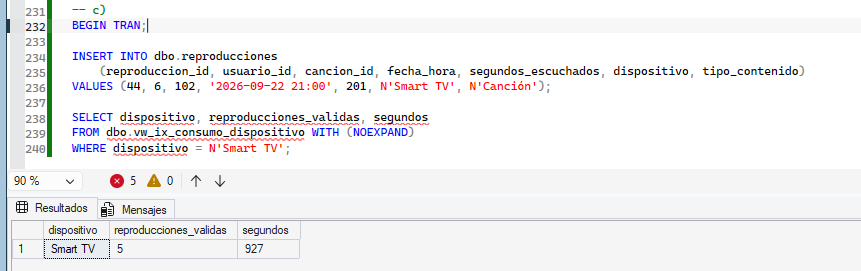

Se abre una transacción, se inserta la reproducción 44 (usuario 6, canción 102, Smart TV, 201 segundos) y se consulta la fila de Smart TV de la vista indexada. Ya refleja el cambio: 5 reproducciones válidas y 927 segundos.

## Requerimientos (Caso de estudio Sonora)

### Requerimiento 1
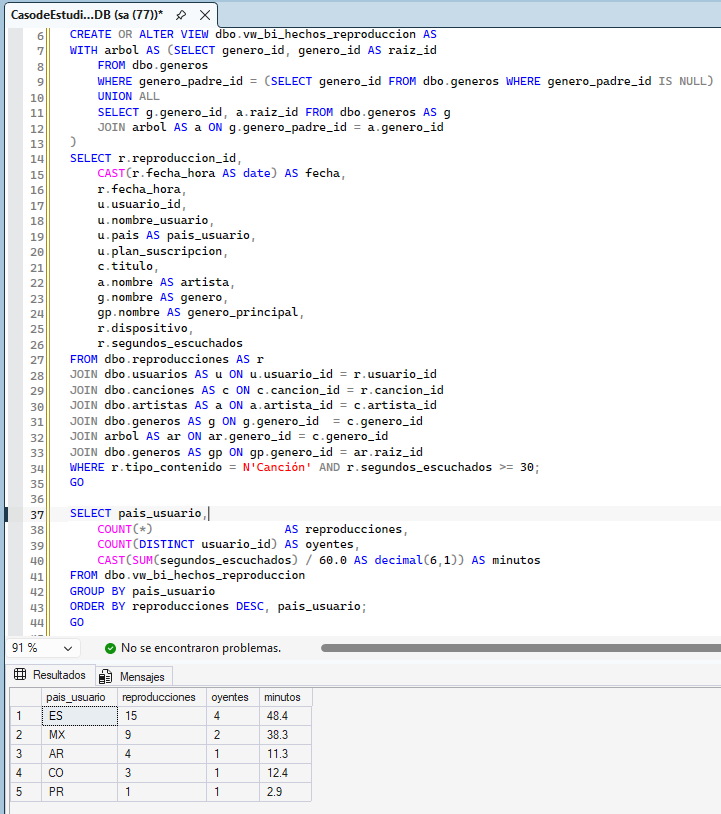

La vista `vw_bi_hechos_reproduccion` contiene una fila por reproducción válida y resuelve el género principal con una CTE recursiva dentro de la propia vista. El resumen por país del usuario muestra ES con 15 reproducciones, 4 oyentes y 48.4 min, MX con 9, 2 y 38.3, AR con 4, 1 y 11.3, CO con 3, 1 y 12.4, y PR con 1, 1 y 2.9.

### Requerimiento 2
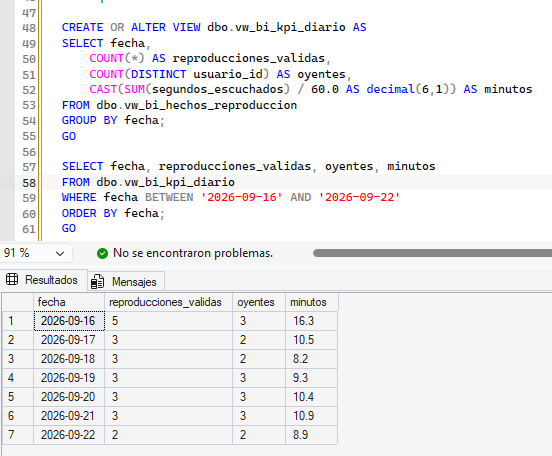

La vista `vw_bi_kpi_diario` se construye sobre la vista de hechos y agrupa por fecha. La consulta de la semana de análisis (16 al 22/09) devuelve 7 días, con 5 reproducciones válidas el 16/09 y 2 el 22/09.

### Requerimiento 3
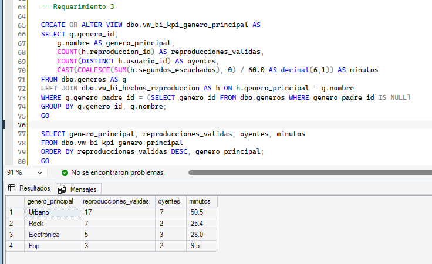

La vista `vw_bi_kpi_genero_principal` parte de `generos` con un `LEFT JOIN` a la vista de hechos, de modo que aparecen los cuatro géneros principales. Ordenados por reproducciones: Urbano 17 (50.5 min), Rock 7 (25.4), Electrónica 5 (28.0) y Pop 3 (9.5).

### Requerimiento 4
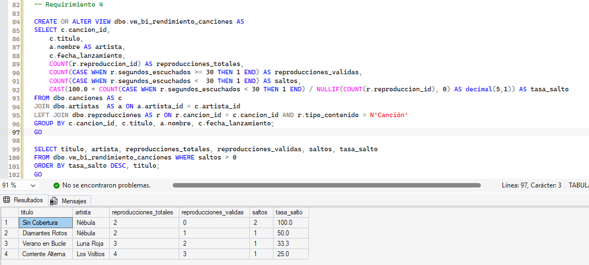

La vista `vw_bi_rendimiento_canciones` calcula reproducciones totales, válidas, saltos y tasa de salto, usando `NULLIF` para evitar la división entre cero. Las canciones con saltos van de Sin Cobertura (100.0 %) a Corriente Alterna (25.0 %), pasando por Diamantes Rotos (50.0 %) y Verano en Bucle (33.3 %).

### Requerimiento 5

**a)**

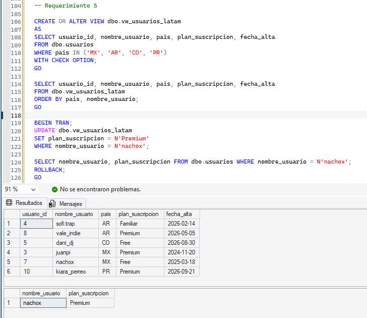

Se crea `vw_usuarios_latam` con los países MX, AR, CO y PR y `WITH CHECK OPTION`. El listado muestra 6 usuarios ordenados por país y nombre. Dentro de una transacción, el `UPDATE` cambia el plan de nachox a Premium a través de la vista y la consulta sobre `usuarios` lo confirma.

**b) y c)**

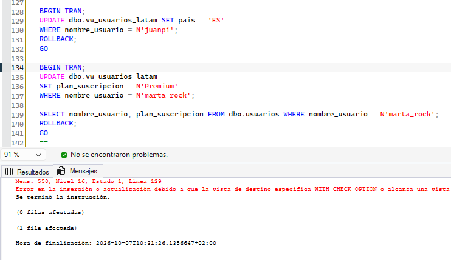

Cambiar el país de juanpi a `ES` falla con el Msg 550, porque sacaría al usuario del ámbito LATAM. El `UPDATE` sobre marta_rock (España) no afecta a ninguna fila: `(0 filas afectadas)`.

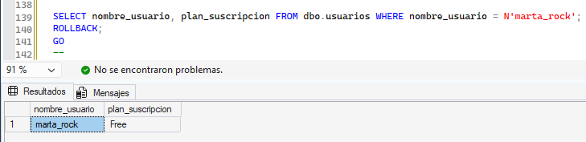

Tras el intento, la consulta sobre `usuarios` muestra que marta_rock sigue con el plan Free.

### Requerimiento 6

**Apartado 1**

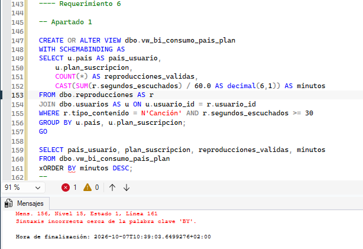

Se crea `vw_bi_consumo_pais_plan` enlazada al esquema (`WITH SCHEMABINDING`). La consulta ordenada por minutos devuelve 7 filas, con ES Premium primero (10 reproducciones, 29.4 min) y PR Premium el último (1, 2.9).

**Apartado 2**

**Explicación:** el `ALTER TABLE` para ampliar `plan_suscripcion` de `nvarchar(20)` a `nvarchar(30)` falla con el Msg 5074 y el Msg 4922. La vista `vw_bi_consumo_pais_plan` tiene `SCHEMABINDING` y depende de esa columna, así que SQL Server bloquea el cambio antes de romper nada.

Para hacer el cambio sin dejar el cuadro de mando roto:
1. Eliminar la vista con `DROP VIEW`.
2. Ejecutar el `ALTER TABLE` para ampliar la columna a `nvarchar(30)`.
3. Volver a crear la vista con la misma definición.
4. Comprobar que la consulta de la vista devuelve los mismos resultados.

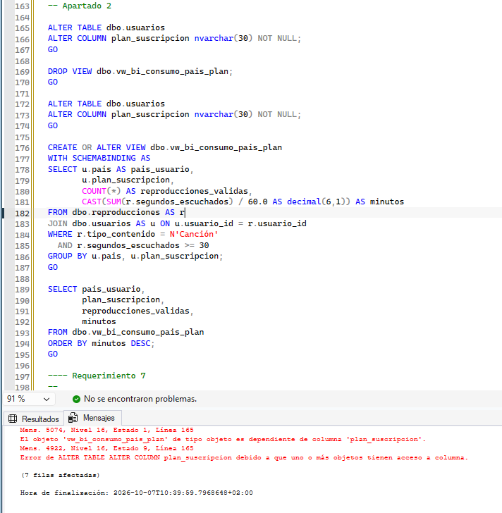

El script del apartado 2 con el primer `ALTER TABLE`, que falla con los mensajes 5074 y 4922. A continuación se elimina la vista, se repite el `ALTER` con éxito, se recrea la vista y la última consulta devuelve `(7 filas afectadas)`.

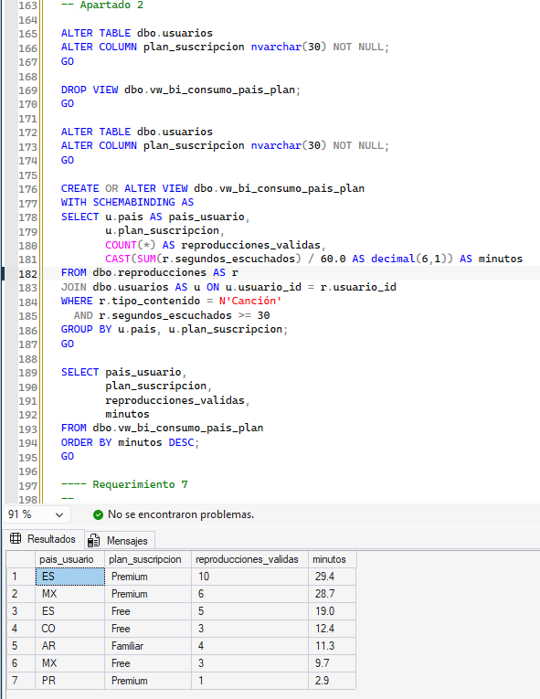

La consulta final de la vista recreada devuelve las 7 combinaciones de país y plan ordenadas por minutos, de ES Premium (29.4) a PR Premium (2.9).

### Requerimiento 7
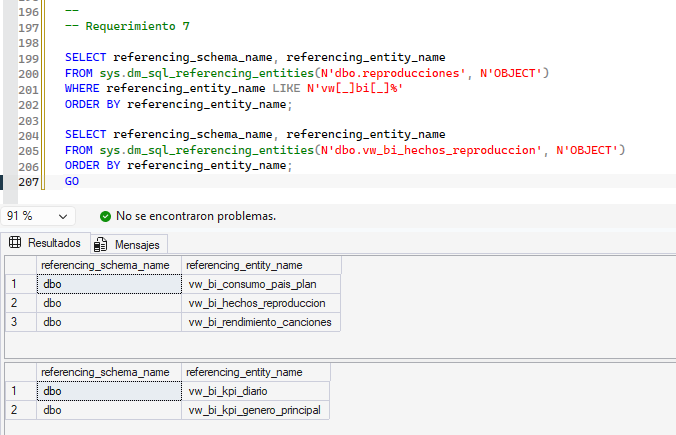

La primera consulta devuelve las vistas `vw_bi_` que leen directamente `dbo.reproducciones`: `vw_bi_consumo_pais_plan`, `vw_bi_hechos_reproduccion` y `vw_bi_rendimiento_canciones`. La segunda devuelve las que leen `vw_bi_hechos_reproduccion`: `vw_bi_kpi_diario` y `vw_bi_kpi_genero_principal`.
